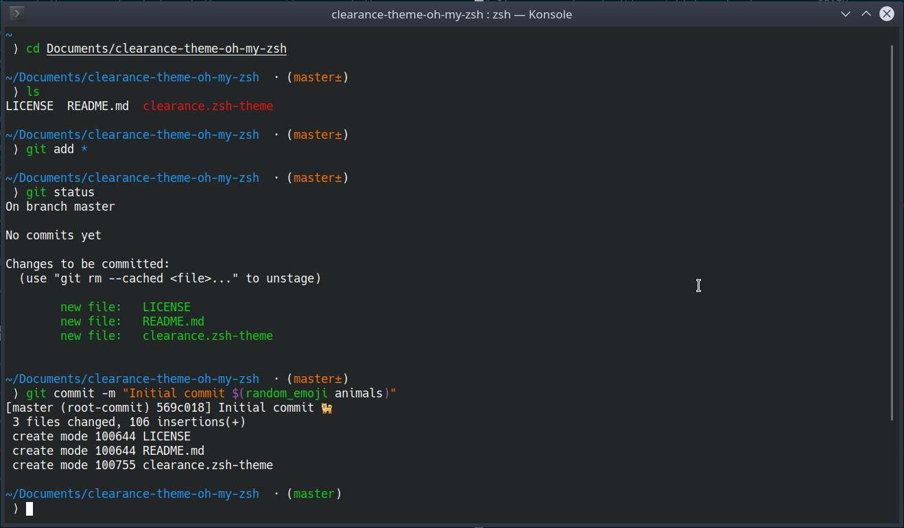

# Clearance oh-my-zsh theme

A minimalist oh-my-zsh theme with git, nix-shell and virtualenv prompt

Based on 
* Avit theme (https://github.com/ohmyzsh/ohmyzsh/blob/master/themes/avit.zsh-theme) 
* Clearance theme for Fish (https://github.com/oh-my-fish/theme-clearance)

## Installation

Clone this repository into your custom oh-my-zsh themes directory:

`git clone https://github.com/H00N24/clearance-theme-oh-my-zsh.git $ZSH_CUSTOM/themes/clearance`

Create a symlink:

`ln -s "$ZSH_CUSTOM/themes/clearance/clearance.zsh-theme" "$ZSH_CUSTOM/themes/clearance.zsh-theme"`

Set `ZSH_THEME="clearance"` in your `.zshrc`.

